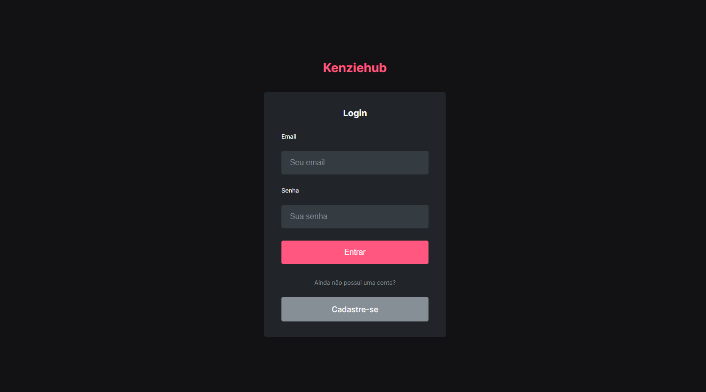
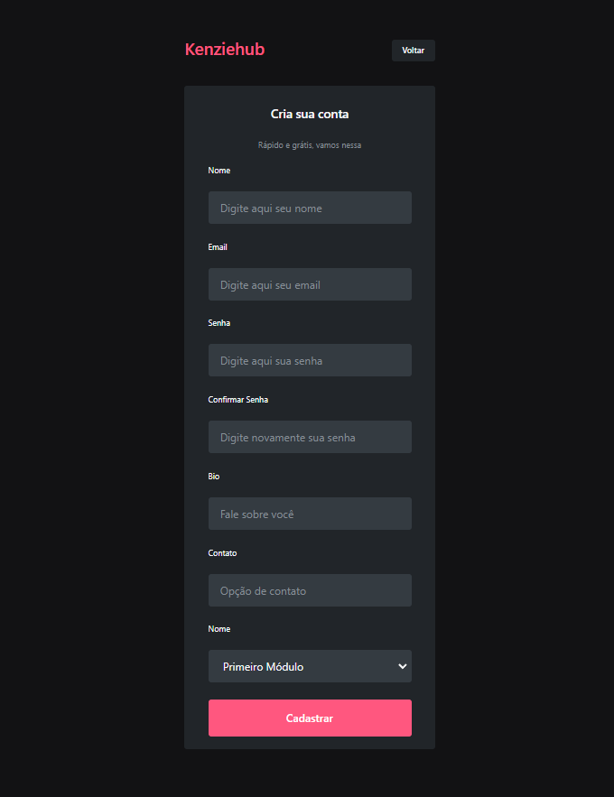
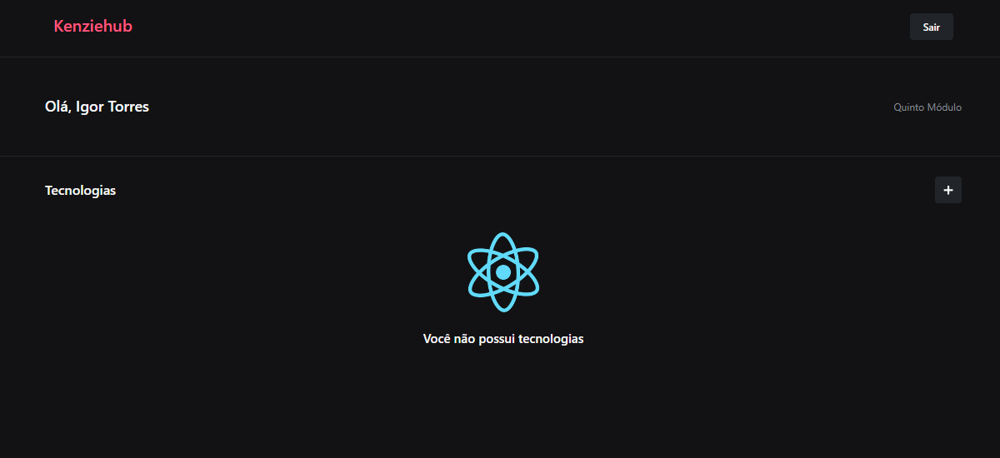
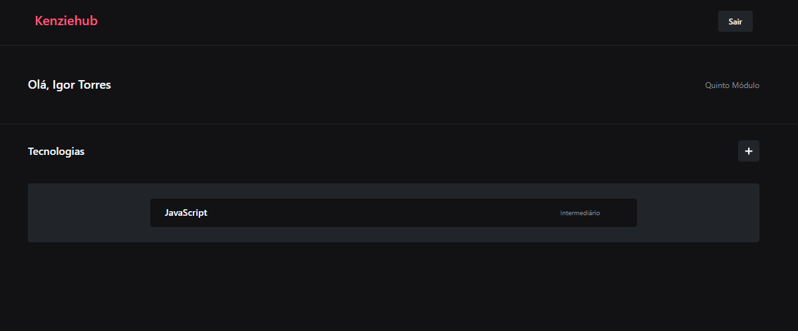
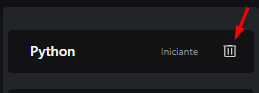
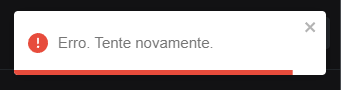
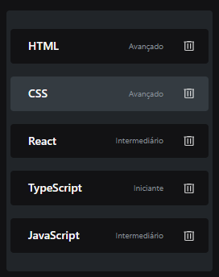

Para README em Português <a href="./README_pt-br.md" target="blank__">clique aqui</a>.

<h2>Preview 🔎</h2>

 

<h1>About 📘</h1>

Kenziehub is a "social network" simulation for developers where the user can create an account, log in, access the dashboard and add their favorite technologies according to their experience level. Originally made with React/JS and refactored to React/TS, kenziehub is a front-end CRUD (Create, Read, Update, Delete) application that uses the endpoint (<a href="https://kenziehub.herokuapp.com/" target="black__">https://kenziehub.herokuapp.com/</a>) to consume and send data.

 

<h2>Project Structuring and Technologies 👩🏻‍💻📂</h2>

In this project, concepts of<strong>API Consumption</strong>, <strong>React Hooks</strong>, <strong>React Context</strong>, <strong>SPA</strong>, <strong>CRUD</strong>, <strong>React Lazy</strong>, <strong>React Suspense, Fallback</strong>, <strong>Renderização Condicional</strong>.

  

<h3>Technologies / Libs</h3>
<ul>
    <li>Axios</li>
    <li>Bootstrap (Button & Modal)</li>
    <li>React Context</li>
    <li>React Hook Form</li>
    <li>React Loader Spinner</li>
    <li>React Router Dom</li>
    <li>React Toastify</li>
    <li>React-ts</li>
    <li>Styled-Components</li>
    <li>TypeScript</li>
    <li>yup</li>
</ul>

 

<h2>How it works 🔨</h2>

 

<h3>Register</h3>
<table>
    <tbody>
        <tr>
            <td style="text-align: center;" width="50%"></td>
            <td width="50%">
On the registration page we have a basic form to capture user information. All fields must be filled in.
</td>
        </tr>
    </tbody>
</table>

 

<h4>Errors ❌</h3>

<table>
    <tbody>
        <tr>
            <td width="50%" style="text-align: center;">
                
            </td>
            <td width="50%">
            
                
When the data sent has a validation error, a tooltip will be displayed that, when hovering the mouse over it, will show what did not satisfy the conditions of the field.

            </td>
        </tr>
    </tbody>
</table>

 

<h4>Sucess! ✅</h3>

<table>
    <tbody>
        <tr>
            <td width="50%">
                

                    If all data is successfully validated, a notification at the top of the page will show the status of the request and you will be redirected in a few seconds to the <strong>login page</strong>.

            </td>
            <td width="50%" style="text-align: center;">
                
            </td>
        </tr>
    </tbody>
</table>

  

<h3>Login</h3>

 

<table>
    <tbody>
        <tr>
            <td width="50%" style="text-align: center;">
                
            </td>
            <td width="50%">
                
To enter your account, simply enter your account email and password in the respective fields.

            </td>
        </tr>
    </tbody>
</table>

<h4>Errors ❌</h4>

<table>
    <tbody>
        <tr>
            <td width="50%" >
                
Similar to the registration page, data validation is done on the login page, however, errors are shown at the top of the page. Here are possible errors:

            </td>
            <td width="50%" style="text-align: center;">
                
                
            </td>
        </tr>
    </tbody>
</table>

<h4>Sucesso! ✅</h4>

If the submitted data matches the database information, you will be redirected to the <strong>Dashboard</strong>!    <strong>Note:</strong> The application has <strong>Auto-login</strong> functionality. Click <strong>"sair"</strong> on the Dashboard to remove this feature the next time you log in to the application.

  

<h3>Dashboard</h3>

 

 

On the Dashboard you can find some information such as your name and your favorite technologies. If there are no technologies added, you can click the add technology button to populate your profile.

 

<h4>Adding Technologies</h4>

 

<table>
    <tbody>
        <tr>
            <td width="50%" style="text-align: center;">
                
            </td>
            <td width="50%" style="text-align: center;">
                
            </td>
        </tr>
    </tbody>
</table>

By clicking on the button, a form will open in the center of the screen. Simply enter the name of the technology, your experience level and click <strong>Cadastrar Tecnologia.</strong>

 

<h4>Errors ❌</h4>

<table>
    <tbody>
        <tr>
            <td width="50%">
                
If something goes wrong, a notification will appear at the top of the screen.

            </td>
            <td width="50%" style="text-align: center;">
                
            </td>
        </tr>
    </tbody>
</table>

 

<h4>Sucess! ✅</h4>

 

 

If all goes well, the added technology will appear in the center of the screen!

 

<h4>Excluding Technologies</h4>

 

In a scenario where you have added a wrong technology or one that you no longer use and want to delete from your profile, there is an option to delete it by pressing the trash button for the respective technology.

<table>
    <tbody>
        <tr>
            <td width="50%" style="text-align: center;">
                
            </td>
            <td width="50%" style="text-align: center;">
                
            </td>
        </tr>
    </tbody>
</table>

 

<h4>Errors ❌</h4>

<table>
    <tbody>
        <tr>
            <td width="50%">
                
In case something goes wrong, similarly to the other features, a notification will appear at the top of the screen.

            </td>
            <td width="50%" style="text-align: center;">
                
            </td>
        </tr>
    </tbody>
</table>

 

<h4>Sucess! ✅</h4>

<table>
    <tbody>
        <tr>
            <td width="50%" style="text-align: center;">
                
            </td>
            <td width="50%">
                
If all goes well, you will no longer see the technology on your Dashboard!

            </td>
        </tr>
    </tbody>
</table>

<h2><strong>Project Link:</strong> <a href="https://kenziehub-typescript-rho.vercel.app/" target="blank_">Kenziehub</a></h2>

 

<h2>Run App Locally</h2>

<ol>
    <li>Clone the repository on your computer.</li>
    <li>Open the terminal in the project directory.</li>
    <li>Type "yarn install" or "npm install" to install dependencies.</li>
    <li>Type "yarn start" or "npm run start" to run the app locally.</li>
</ol>
