For README in English <a href="./README.md" target="blank__">click here</a>.

<h2>Preview 🔎</h2>
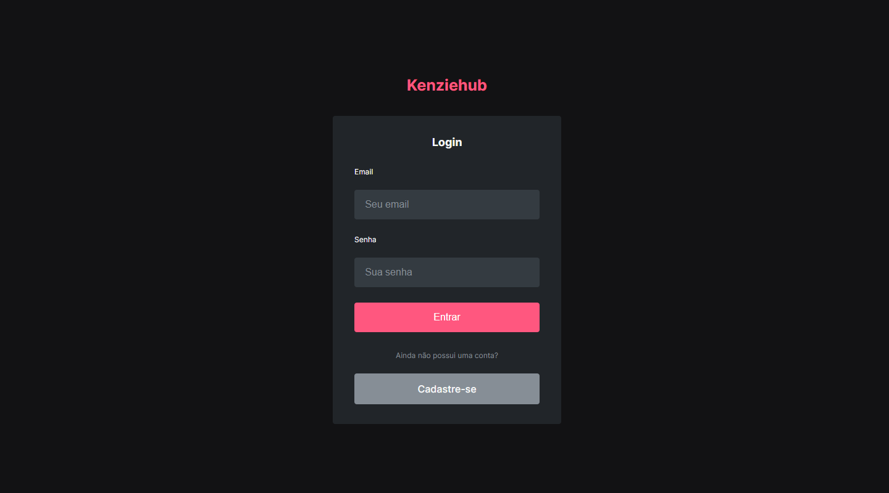

 

<h1>Sobre 📘</h1>

Kenziehub é uma simulação de "rede social" para desenvolvedores onde o usuário pode criar uma conta, logar, ter acesso a dashboard e adicionar suas tecnologias favoritas de acordo com seu nível de experiência. Originalmente feita com React/JS e refatorada para React/TS, kenziehub é uma aplicação Front-end CRUD (Create, Read, Update, Delete) que utiliza o endpoint (<a href="https://kenziehub.herokuapp.com/" target="black__">https://kenziehub.herokuapp.com/</a>) para consumir e enviar dados.

 

<h2>Estruturação de Projeto e Tecnologias 👩🏻‍💻📂</h2>

Neste projeto foram utilizados conceitos de <strong>Consumo de Api</strong>, <strong>React Hooks</strong>, <strong>React Context</strong>, <strong>SPA</strong>, <strong>CRUD</strong>, <strong>React Lazy</strong>, <strong>React Suspense, Fallback</strong>, <strong>Renderização Condicional</strong>.

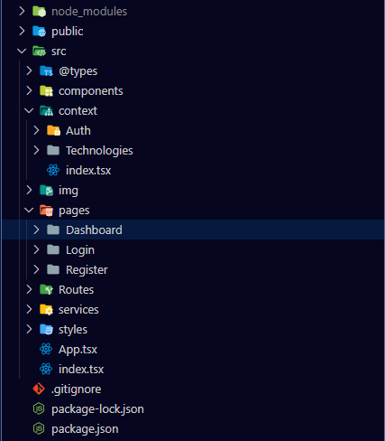

  

<h3>Tecnologias / Bibliotecas</h3>
<ul>
    <li>Axios</li>
    <li>Bootstrap (Button & Modal)</li>
    <li>React Context</li>
    <li>React Hook Form</li>
    <li>React Loader Spinner</li>
    <li>React Router Dom</li>
    <li>React Toastify</li>
    <li>React-ts</li>
    <li>Styled-Components</li>
    <li>TypeScript</li>
    <li>yup</li>
</ul>

 

<h2>Como Funciona 🔨</h2>

 

<h3>Registro</h3>
<table>
    <tbody>
        <tr>
            <td style="text-align: center;" width="50%">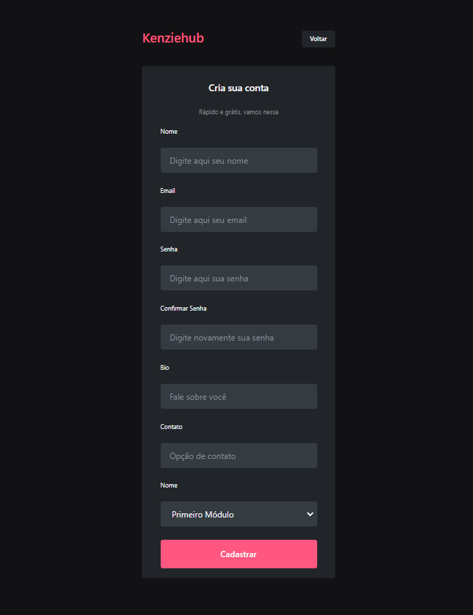</td>
            <td width="50%">
Na página de registro temos um formulário básico para capturar as informações do usuário. Todos os campos devem ser preenchicos.
</td>
        </tr>
    </tbody>
</table>

 

<h4>Erros ❌</h3>

<table>
    <tbody>
        <tr>
            <td width="50%">
                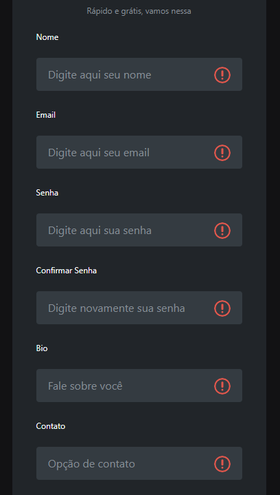
            </td>
            <td width="50%">
            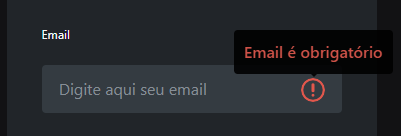
                
Quando os dados enviados tiverem algum erro de validação, será mostrada uma tooltip que ao passar o mouse em cima, mostrará o que não satisfez as condições do campo.

            </td>
        </tr>
    </tbody>
</table>

 

<h4>Sucesso! ✅</h3>

<table>
    <tbody>
        <tr>
            <td width="50%">
                
Caso todos os dados sejam validados com sucesso, uma notificação na parte superiora da página irá mostrar o status da requisição e você será redirecionado em alguns segundos para a página de <strong>login</strong>.

            </td>
            <td width="50%">
                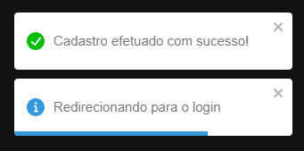
            </td>
        </tr>
    </tbody>
</table>

  

<h3>Login</h3>

 

<table>
    <tbody>
        <tr>
            <td width="50%">
                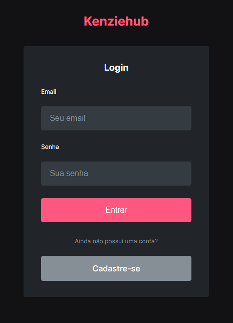
            </td>
            <td width="50%">
                
Para entrar na sua conta basta digitar o email e a senha de sua conta nos respectivos campos.

            </td>
        </tr>
    </tbody>
</table>

<h4>Erros ❌</h4>

<table>
    <tbody>
        <tr>
            <td width="50%">
                
Semelhante a página de registo, a validação de dados é feita na página de login, porém, os erros são mostrados na parte superior da página. Aqui estão os possíveis erros:

            </td>
            <td width="50%">
                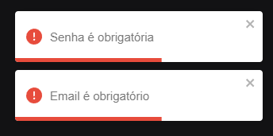
                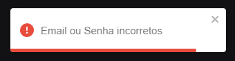
            </td>
        </tr>
    </tbody>
</table>

<h4>Sucesso! ✅</h4>

Se os dados enviados combinarem com as informações do banco de dados, você será redirecionado para a <strong>Dashboard</strong>!    <strong>Nota:</strong> A aplicação conta com a funcionalidade de <strong>Auto-login</strong>. Clique em <strong>"sair"</strong> na Dashboard para remover esta funcionalidade na próxima vez que entrar na aplicação.

  

<h3>Dashboard</h3>

 

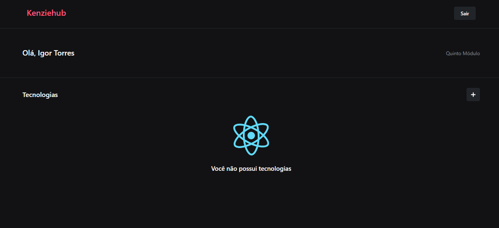

 

Na Dashboard você encontra algumas informações como seu nome e suas tecnologias favoritas. Se não houver tecnologias adicionadas você pode clicar no botão de adicionar tecnologia para popular seu perfil.

 

<h4>Adicionando Tecnologias</h4>

 

<table>
    <tbody>
        <tr>
            <td width="50%">
                
            </td>
            <td width="50%">
                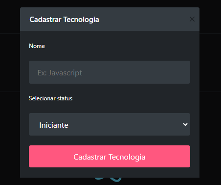
            </td>
        </tr>
    </tbody>
</table>

Ao clicar no botão, um formulário irá abrir no centro da tela. Basta inserir o nome da tecnologia, seu nível de experiência e clicar em <strong>Cadastrar Tecnologia.</strong>

 

<h4>Erros ❌</h4>

<table>
    <tbody>
        <tr>
            <td width="50%">
                
Caso algo dê errado, uma notificação irá aparecer na parte superior da tela.

            </td>
            <td width="50%">
                
            </td>
        </tr>
    </tbody>
</table>

 

<h4>Sucesso! ✅</h4>

 

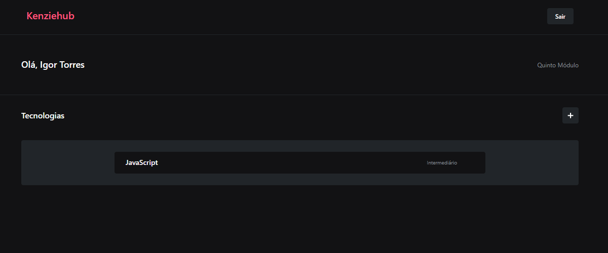

 

Se tudo der certo, a tecnologia adicionada irá aparecer no centro da tela!

 

<h4>Excluindo Tecnologias</h4>

 

Num cenário em que você tenha adicionado uma tecnologia errada ou que não utiliza mais e queira excluir do seu perfil, existe a opção de excluir apertando no botão da lixeira da respectiva tecnologia.

<table>
    <tbody>
        <tr>
            <td width="50%">
                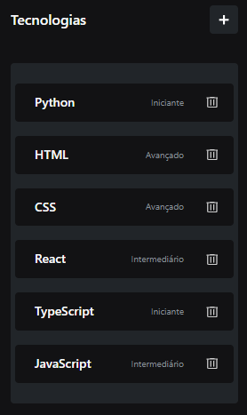
            </td>
            <td width="50%">
                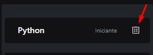
            </td>
        </tr>
    </tbody>
</table>

 

<h4>Erros ❌</h4>

<table>
    <tbody>
        <tr>
            <td width="50%">
                
Caso algo dê errado, semelhantemente as outras funcionalidades, uma notificação irá aparecer na parte superior da tela.

            </td>
            <td width="50%">
                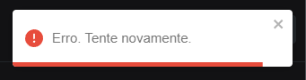
            </td>
        </tr>
    </tbody>
</table>

 

<h4>Sucesso! ✅</h4>

<table>
    <tbody>
        <tr>
            <td width="50%">
                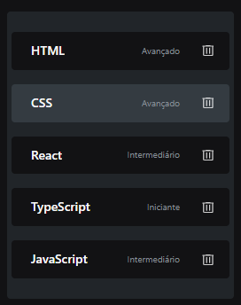
            </td>
            <td width="50%">
                
Se tudo der certo, você não verá mais a tecnologia em seu Dashboard!

            </td>
        </tr>
    </tbody>
</table>

<h2><strong>Link do Projeto:</strong> <a href="https://kenziehub-typescript-rho.vercel.app/" target="blank_">Kenziehub</a></h2>
